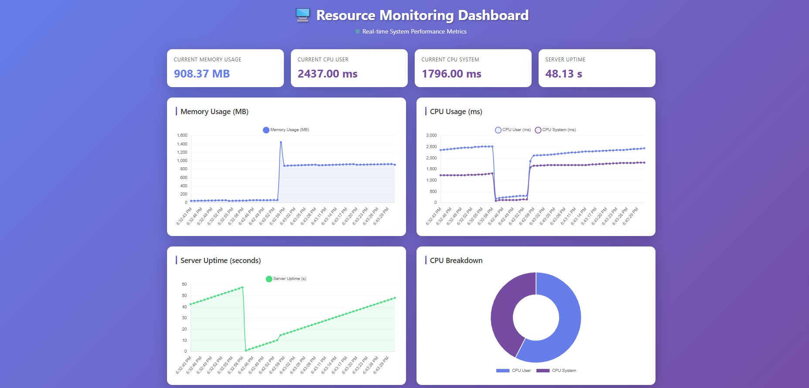

# 📊 Resource Monitoring Tool



A real-time system resource monitoring dashboard built with **Node.js**, **Express.js**, **Socket.IO**, **Chart.js**, and **EJS**. Features a clean MVC architecture, real-time bidirectional communication, and beautiful responsive UI.

## ✨ Key Features

- **🔄 Real-time Monitoring** - Live system metrics with WebSocket updates (Socket.IO)
- **📈 Interactive Charts** - 4 beautiful Chart.js visualizations updating in real-time
- **🎨 Responsive Design** - Mobile-first UI with CSS Grid and Flexbox
- **🏗️ MVC Architecture** - Clean separation of concerns with Models, Controllers, Routes, and Middleware
- **⚡ Zero-Polling** - Bidirectional Socket.IO communication for instant updates
- **💾 Data Persistence** - Automatic metrics storage in `data.json`
- **📱 Cross-browser Support** - Works on all modern browsers

## 🚀 Quick Start

### Prerequisites
- Node.js 14+ and npm installed

### Installation

1. **Clone or download the project**
   ```bash
   cd resource-monitoring-tool
   ```

2. **Install dependencies**
   ```bash
   npm install
   ```

3. **Start the development server**
   ```bash
   npm run dev
   ```
   The server will start on `http://localhost:3000`

   **Production mode:**
   ```bash
   npm start
   ```

## 📡 API Endpoints

| Method | Endpoint | Description |
|--------|----------|-------------|
| GET | `/` | API documentation landing page |
| GET | `/api/resource-monitor` | Real-time dashboard with charts |
| GET | `/health` | Health check endpoint |
| GET | `/api/resource-data` | Get latest resource metrics (JSON) |
| GET | `/heavy-task` | Trigger CPU-intensive operation (for testing) |

### Example Response: `/api/resource-data`
```json
{
  "timestamp": "2024-01-15T10:33:52.123Z",
  "memory": {
    "rss": 45.23,
    "heapUsed": 28.15,
    "heapTotal": 56.00
  },
  "cpu": {
    "user": 150,
    "system": 85
  },
  "uptime": 125.45
}
```

## 🏗️ Project Structure

```
resource-monitoring-tool/
├── server.js                                   # Application entry point
├── package.json                                # Dependencies and scripts
├── data.json                                   # Metrics storage
├── src/
│   ├── controllers/
│   │   └── resource-monitor.controller.js      # Request handlers
│   ├── utils/
│   │   └── util.js                             # utils function
│   └── views/
│       ├── index.ejs                           # Dashboard template
│       └── api-docs.ejs                        # API documentation UI
└── README.md                                   # This file
```

## 🔧 Technologies

| Technology | Purpose | Version |
|-----------|---------|---------|
| **Node.js** | JavaScript runtime | Latest LTS |
| **Express.js** | Web framework (ES Modules) | ^4.18.2 |
| **Socket.IO** | Real-time bidirectional communication | ^4.8.1 |
| **EJS** | Template engine | ^3.1.10 |
| **Chart.js** | Interactive charts (CDN) | Latest |
| **CSS3** | Responsive styling | Modern |

## 📊 Metrics Collected

- **Memory Usage**: RSS (Resident Set Size) in MB
- **Heap Memory**: Used and Total heap in MB
- **CPU Time**: User and System time in milliseconds
- **Server Uptime**: Seconds since server start
- **Timestamp**: ISO 8601 format collection time

*Metrics collected every 1 second and broadcast via Socket.IO*

## 🔌 Socket.IO Events

### Server → Client
- **`initial-data`** - Send initial metrics on connection
- **`resource-update`** - Send updated metrics every 1 second

### Client → Server
- **`connect`** - Connection established
- **`disconnect`** - Client disconnected

## 💡 Usage Examples

### View Real-time Dashboard
```
http://localhost:3000/api/resource-monitor
```

### API Documentation UI
```
http://localhost:3000/
```
Click any endpoint button to test it in a new tab

### Check Server Health
```bash
curl http://localhost:3000/health
```

### Get Current Metrics
```bash
curl http://localhost:3000/api/resource-data
```

## ⚙️ Configuration

Environment variables (optional):
- `PORT` - Server port (default: 3000)
- `NODE_ENV` - Environment mode (development/production)

## 🎯 MVC Architecture Explanation

This project follows the Model-View-Controller pattern:

- **Views** (`src/views/`) - EJS templates for HTML rendering
- **Controllers** (`src/controllers/`) - Request handlers and orchestration
- **Utils** (`src/utils/`) - Utility functions (metric collection, calculations)

## 📋 Development Commands

```bash
# Start development server (with auto-reload)
npm run dev

# Start production server
npm start

# Run tests
npm test
```

## 👨‍💻 Author

Created as part of Professional Backend Development Course

---

**Happy Monitoring! 🎉**
